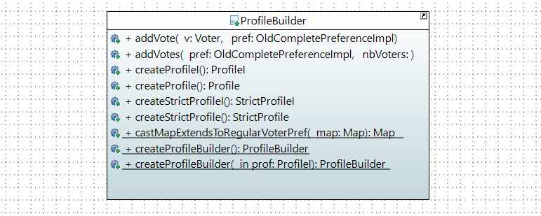
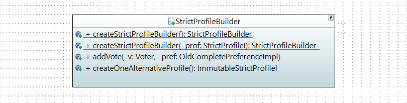

= Build Profile methods

====== link:../README.adoc[Summary]

== Profile Builder

[cols="1,2", options="header"] 
|===
|Method name
|Contract

|castMapExtendsToRegularVoterPref(Map<Voter, ? extends OldCompletePreferenceImpl>)
|this static method has a Map as argument which contains a Voter and an extends of OldcompletePreferenceImpl. It checks if this map is not null and then it return a map that not extends OldCompletePreference.

|createProfileBuilder()
|This static factory method create a new ProfileBuilder with no arguments.

|createProfileBuilder(ProfileI)
|This static factory method accept a ProfileI as argument and checks if it is not null. If this profileI is null, it calls createProfileBuilder() else it returns a new ProfileBuilder with this profileI as argument.

|addVote(Voter, OldCompletePreferenceImpl)
|This method has a Voter and an OldCompletePreferenceImpl as arguments. It checks if these arguments are not null. This method put the preference for the voter in a map.

|addVotes(OldCompletePreferenceIml, int)
|This method accept an OldCompletePreferenceImpl and a number of voters as arguments. Then it checks if these arguments are not null. Finally it put for each number of voters a preference in the map.

|createProfile()
|This method return an ImmutableProfile from the builder if it is complete, else it throws an exception.

|createProfileI()
|This method return an ImmutableProfile from the builder.

|createStrictProfile()
|This method return an ImmutableStrictProfile from the builder if it is strict and complete, else it throws an exception.

|createStrictProfileI()
|This method return an ImmutableStrictProfile from the builder if it is strict, else it throws an exception.
|===

== Strict Profile Builder

 

=== What will do this class

The goal of this class is to build strict profiles.

A StrictProfile represents a complete StrictProfile. The preferences _(*)_ are strict. The preferences are about the same alternatives exactly.

_(*) NB : Currently, the StrictProfileBuilder class still uses the old Preference implementation (OldCompletePreferenceImpl) of the project. It should be changed to a CompletePreference.

[cols="1,2", options="header"] 
|===
|Method name
|Contract

|createStrictProfileBuilder()
|This is a static factory method which returns a new StrictProfileBuilder without parameters.

|createStrictProfileBuilder(StrictProfileI prof)
|This is a static factory method which check if the argument prof is null or not. If prof is not null, it returns a new StrictProfileBuilder with the parameter prof. Else it calls createStrictProfileBuilder().

|addVote(Voter, OldCompletePreferenceImpl)
|This method takes an Voter and a an OldCompletePreferenceImpl as argument. It checks if this arguments are not null and if the preference is strict. Then it put this vote in the map.

|createOneAlternativeProfile()
|This method has not argument and it create an ImmutableStrictProfileI from a StrictProfileI where only the first alternative of each preference is taken into account.

|===