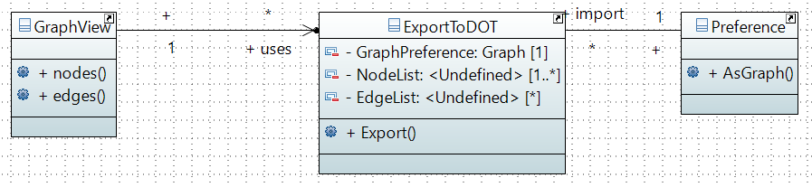

= Export a preference in DOT format

====== link:../README.adoc[Summary]

=== Export Preference in DOT Format Diagram

=== What will do this class +

The goal of the ExportDOT class is to export a preference in link:./DOTformat.adoc[DOT format]. 

A preference have to be represented by a directed graph. The preference interface has a method link:./preferenceInterfaces.adoc[asGraph()] which returns a preference as a directed graph. So all preferences can be converted into a directed graph and given to the export method.

The static method of the ExportDOT class makes sure that the provided graph is a directed graph and then converts it to DOT format. Finally, thanks to the java class PrintWriter (which is an subclass of link:https://docs.oracle.com/javase/7/docs/api/java/io/Writer.html[Writer]), it is possible to export by an output characters stream.

== Export Preference in DOT format methods analysis +

[cols="1,1,2", options="header"] 
|===
|Method name
|Contract
|Relevance

|Export(DirectedGraph pref, Writer w)
|This is a static void method which takes two argument : A directed graph that represents a preference and a Writer (to write flows of characters) which export it in DOT format. It would be useful to make sure that the export method receives a directed graph using the isDirectedGraph() method. Then convertodot() converts the oriented graph and sends the string to the print() method of the PrintWritter subclass of Writer. 
|To do

|isDirectedGraph(DirectedGraph g)
|This is a private method which @return true when the argument is a directed graph.  
|To do

|convertToDoT(DirectedGraph g)
|It is a private method which @return the directed graph in DOT Format as String.
|To do

|===