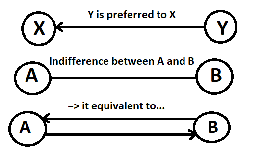

== DOT FORMAT

=== PRESENTATION:

The DOT format is a simple file format which describes graphs. This type of file is used by graph visualization applications.
The DOT format describes three types of objects: graphs, nodes and edges.
Graphs can be directed (indicated by the keyword digraph) or undirected (graph).

A graph can be used to represent a classification between elements (link:https://hal.archives-ouvertes.fr/hal-01526540/document[here] for more informations : _Philippe Vincke, La modélisation des préférences, Institut de mathématiques économiques 1985, 24 p., figures, bibliographie. ffhal-01526540_).
In the case of a link:./preferenceInterfaces.adoc[Preference], the graph will be necessarily oriented, because a Preference is a ranking of Alternatives. Each vertex represents an alternative, the orientation of the edge indicates the ranking.

*Example of element ranking with graph :*

=== SYNTAX:

The DOT’s syntax is quite simple. The first line indicates the type of the graph and its name.
Then, the following lines, which are between brackets, represent vertices and edges.
A vertex is created when its name appears for the first time in the list.
An edge is created when the vertices are connected by an edge operator: - - for an undirected graph and - > for a directed one.
We can also create a subgraph which is a subset of edges.

=== ATTRIBUTES:

The DOT format also allows to specify attributes in order to modify the graph representation and the arrangement of vertices and edges. The attributes are indicated between [] after the vertex or the edge they refer to.
Here are some attributes:
*size, to set the size of the graph (in inches)
*shape, to set the shape of the edge
*style, to set the style of the vertex
*color, to set the edge’s color
*...

The keyword edge allows to define attributes associated to all the edges at the same time. Like-wise, for the keyword node for the vertices.
Finally, the DOT format represents a graph in different layers.

=== EXAMPLE :

Here we imagine a Preference between the Alternatives "Superman", "Batman", and "Spiderman".

The above graph is produced by the code below. It expresses the Preference of voter #37.

----
graph Votant_37 {
        bgcolor=azure;
        node [shape=circle, color=green, style=filled];
        edge [arrowsize=1, color=red];
        "Superman" -> "Batman";
        "Batman" -> "Spiderman";
}
----

For more details: http://www.graphviz.org/doc/info/lang.html
