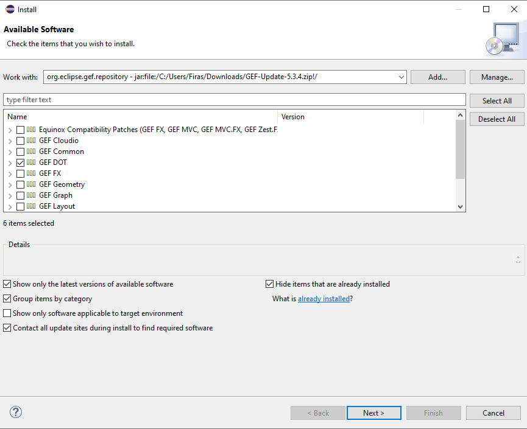
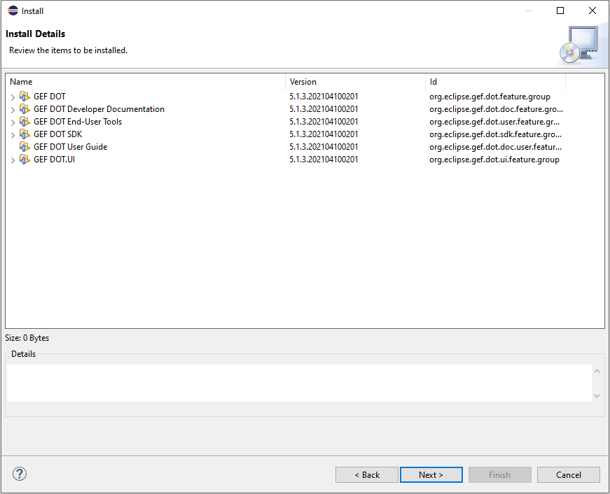
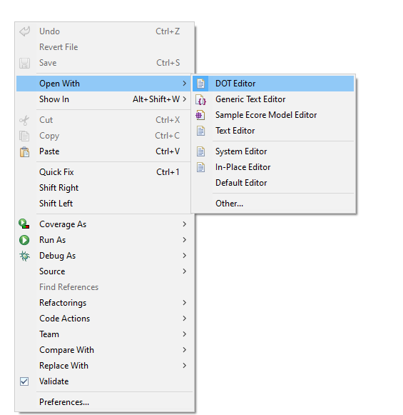
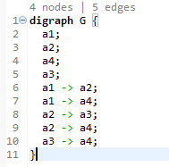
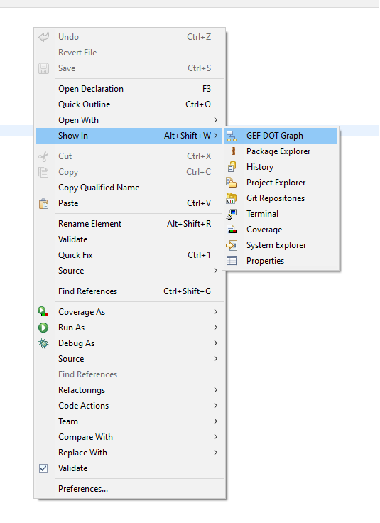
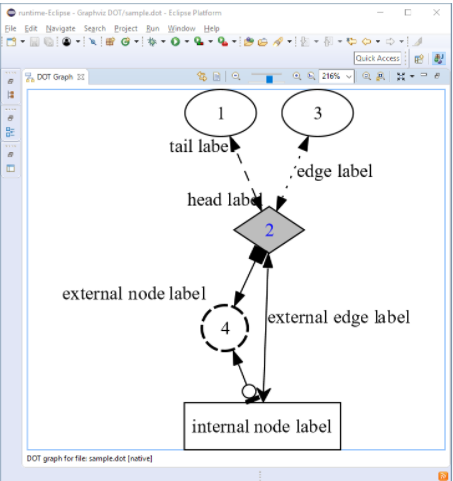

= Graphviz DOT

== Introduction

Graphviz is one of the components provided by GEF in its DOT component, it is a very interesting plugin to handle files in DOT formats it provides us with an editor, a view to 
display the graph of the DOT file as well as a function to export .DOT formats in other formats (PDF, JPG, SVG, etc..).

=== How to install GraphViz with GEF on eclipse

Go to Eclipse click on the help tab > Install new software. Paste this http://download.eclipse.org/tools/gef/updates/releases link and click on add. Then go back to step 4. If this procedure does not work, please follow the next steps from the step 1.

*1.* First of all, you have to go to this link:https://www.eclipse.org/gef/downloads/index.php?showAll=1&showMax=5[here]

*2.* Then you have to download a version that is close to your Eclipse version, for example i have eclipse 2020-12, i will download GEF 5.3.2.

*3.* Once the archive is downloaded, go to eclipse click on the help tab > Install new software > add > archives > *select the zip file we just downloaded* > click on add

*4.* Now you have to select GEF Dot and click on Next

*5.* If the system, shows you all the installation details, for example as here you can click on Next.

*6.* Finally, you must accept the general conditions, and press restart now.

=== DOT Editor

First, you must select the DOT editor instead of the basic one, for that you must right click in the editor of the DOT file > open with > Dot Editor Like this:

Now your editor recognizes, the dot language

=== The basic functions of the DOT format

First of all, you can that thanks to the editor the code is now highlighted, which will simplify the manipulation for us.
The editor also allows to warn the user in case of syntax error, it also includes an auto-corrector, and an auto-completion tool. The DOT language allows a wide customization (color and style of vertices, edges, text additions...) of the drawing of the output graph. Thus these tools greatly facilitate the verification, editing and customization of DOT files and therefore of the drawing of the output graph.   

Now, let's analyze the code above...

[cols="1,1", options="header"] 
|===
|Line
|Explications

|Line 1
|When you code a graph you must always start by writing "digraph" and then add the name of the graph. 
In our example it is called G and finally you have to open braces to write the code of the graph in its braces.

|Line 2-5
|Are the declarations, of the vertices of this graph in our case so we have 4 vertices (a1, a2, a3, a4) as confirmed by the line above line 1.

|Line 6-10 
|They are the declaration of the arcs between the vertices of the graph. 
In our example a2 is the successor of a1. It is possible to put edge in the place of the arcs, for that it is necessary to replace the "->" by "--".

|Line 11 
|The brace of this line marks the end of the code of graph G.

|===

For more information about the DOT Editor, I refer you to this link:https://github.com/eclipse/gef/wiki/DOT-User-Guide[link] 
where you can discover all this interesting features.

=== DOT Graph View
The second most interesting feature of graphviz, is graph view which allows you to draw the output graph you have coded.
Graph View also continuously updates the drawn graph according to the code. This again makes it easy to customize the output graph design.
To use it you have to do: 
right click in the editor of the DOT file > show in > GEF DOT Graph

Unfortunately, for us this feature does not work it displays the following error message :

"Plug-in "org.eclipse.gef.dot.ui" was unable to instantiate class "org.eclipse.gef.dot.internal.ui.DotGraphView"."

With a research on google, we found these sites : 
https://www.eclipse.org/forums/index.php/t/1106351/
a comment redirects us to this other link:https://www.eclipse.org/forums/index.php?t=thread&frm_id=81[forum] where a discussion on the problem exists.

But for the example he should have given us something that looks like this: 

Source : https://github.com/eclipse/gef/wiki/DOT-User-Guide

=== Suggestion
Try installing graphViz by creating an environment as shown link:https://github.com/eclipse/gef#readme[here].
