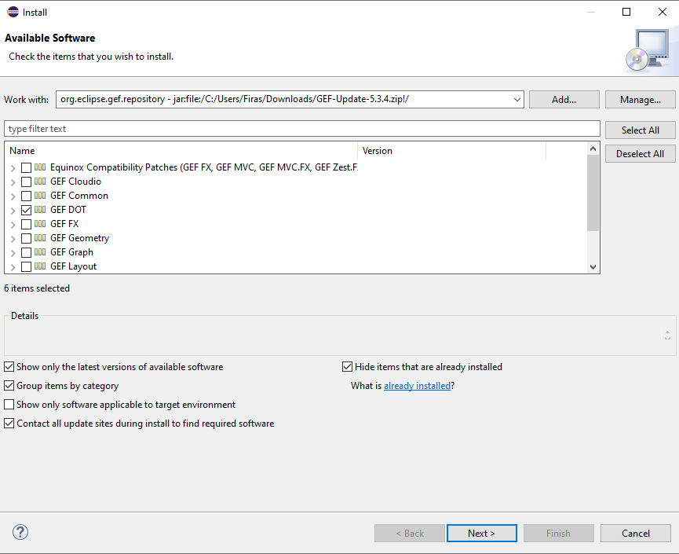
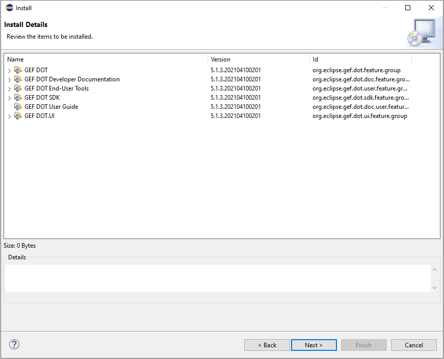

= Graphviz DOT

== Introduction

Graphviz is one of the components provided by GEF in its DOT component, it is a very interesting plugin to handle files in DOT formats it provides us with an editor, a view to 
display the graph of the DOT file as well as a function to export .DOT formats in other formats

=== How to install GraphViz with GEF on eclipse

*1* First of all, you have to go to this link:https://www.eclipse.org/gef/downloads/index.php?showAll=1&showMax=5[here]

*2* Then you have to download a version that is close to your Eclipse version for example I have eclipse 2020-12 I will download GEF 5.3.2

*3* Once the archive is downloaded, go to eclipse click on the help tab > Install new software > add > archives > *select the zip file we just downloaded* > click on add

*4* Now you have to select GEF Dot and click on Next

*5* if the system shows you all the installation details for example as here you can click on Next

*6* Finally you must accept the general conditions and press restart now

=== DOT Editor

First, you must select the DOT editor instead of the basic one, for that you must right click in the editor of the DOT file > open with > Dot Editor Like this:

image:../assets/tutographviz_3.PNG

Now your editor recognizes the dot language

=== The basic functions of the DOT format

Let's analyze the code below to know the most basic features

image:../assets/tutographviz_4.PNG

First of all, you can that thanks to the editor the code is now highlighted, which will simplify the manipulation for us.

[cols="1,1", options="header"] 
|===
|Line
|Explications

|Line 1
|When you code a graph you must always start by writing "digraph" and then add the name of the graph. 
In our example it is called G and finally you have to open braces to write the code of the graph in its braces

|Line 2-5
|Are the declarations of the vertices of this graph in our case so we have 4 vertices (a1, a2, a3, a4) as confirmed by the line above line 1

|Line 6-10 
|They are the declaration of the arcs between the vertices of the graph. 
In our example a2 is the successor of a1. It is possible to put edge in the place of the arcs for that it is necessary to replace the "->" by "--"

|Line 11 
|The brace of this line marks the end of the code of graph G

|===

We have just seen the basic functionalities but they are very important to be able to code in DOT. Of course there are many other interesting features 
that allow you to add color, modify the style of the edge, add text etc ... I refer you to this link:https://github.com/eclipse/gef/wiki/DOT-User-Guide[link] 
where you can discover them all. 

=== DOT Graph View
The second most interesting feature of graphviz is graph view which allows you to draw the graph you have coded to use it you have to do : 
right click in the editor of the DOT file > show in > GEF DOT Graph:

image:../assets/tutographviz_5.PNG

Unfortunately for us this feature does not work it displays the following error message :

image:../assets/tutographviz_6.PNG

We have not found any solution on the internet for this error, but we are continuing our research. 
But for the example he should have given us something that looks like this: 

image:../assets/tutographviz_7.PNG

Source : https://github.com/eclipse/gef/wiki/DOT-User-Guide
