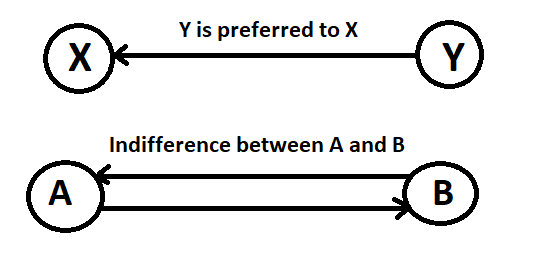

= 2.2 Input/Output Files 

====== link:../README.adoc[Summary]

====== In addition to this document, you can consult the link:http://www.preflib.org/data/format.php#soc[Preflib documentation].

== SOC file

Each file with a soc extension contains a profile consisting of a complete, transitive, and asymmetric relation over a group of objects.

If you want to create your own one, you have to imagine a profile and to follow some writing rules.
Here is an example of a .soc file and its meaning.

[cols="1,1", options="header"] 
|===
|What to write
|What it means

|4
|Number of alternatives

|1
|Alternative 1

|2
|Alternative 2

|3
|Alternative 3

|4
|Alternative 4

|6,6,3
|Number of voters, Number of voters who actually voted, Number of different orders 

|2,1,2,3,4
|2 voters chose this order : Alternative 1 > Alternative 2 > Alternative 3 > Alternative 4

|1,4,2,1,3
|1 voter chose this order : Alternative 4 > Alternative 2 > Alternative 1 > Alternative 3

|3,2,3,1,4
|3 voters chose this order : Alternative 2 > Alternative 3 > Alternative 1 > Alternative 4
|===

Some other formats exist *as below*

== Differents formats for _voting data_

=== RanksFormat 

This format allows non strict preference. The rank of each alternative in the preference is filled in for every voter.

Example Ranks format :
link:../../src/test/resources/io/github/oliviercailloux/j_voting/profiles/management/rank_format.ods[rank_format.ods]

Example Rank format reduced : 
link:../../src/test/resources/io/github/oliviercailloux/j_voting/profiles/management/rank_format_reduced.ods[rank_format_reduced.ods]

.Example of Rank format
[options="header"]
|==============
||1|2|3|4|5|6
|1|1|1|5|5|4|1
|2|3|1|4|4|4|1
|3|2|2|2|2|1|1
|4|3|4|3|3|3|2
|5|4|3|1|1|2|3
|==============

.Meaning of Rank format
[options="header"]
|============================
||Voter 1|Voter 2|Voter 3|Voter 4|Voter 5|Voter 6
|Alternative 1|Alternative 1 is the preferred alternative of Voter 1(1st rank)|1|5|5|4|Voter 6 chose alternative 1 in 1st rank (ex-aequo with alternatives 2 & 3)
|Alternative 2|3|1|Voter 3 chose alternative 2 in 4th rank|4|4|1
|Alternative 3|2|2|2|2|1|1
|Alternative 4|3|4|3|3|3|2
|Alternative 5|4|3|1|1|2|3
|============================

=== VotersToRankings 

This format allows only strict preference. The preference for each voter is filled in.

Example VotersToRankings format : 
link:../../src/test/resources/io/github/oliviercailloux/j_voting/profiles/management/profile_format_strict.ods[profile_format_strict.ods]

Example VotersToRankings format reduced : 
link:../../src/test/resources/io/github/oliviercailloux/j_voting/profiles/management/profile_format_strict_reduced.ods[profile_format_strict_reduced.ods]

.Example of Profile format
[options="header"]
|==============
|1|2|3|4|5|6
|1|2|4|5|2|1
|3|5|2|1|3|4
|2|1|3|2|4|5
|4|2|5|3|5|2
|5|3|1|4|1|3
|==============

.Meaning of Profile format
[options="header"]
|==============
|Voter 1|Voter 2|Voter 3|Voter 4|Voter 5|Voter 6
|Alternative 1|2|4|Alternative 5|2|1
|Alternative 3|5|2|Alternative 1|3|4
|Alternative 2|1|3|Alternative 2|4|5
|Alternative 4|2|5|Alternative 3|5|2
|Alternative 5|3|1|Alternative 4|1|3
|==============

=== CountOfRankings

This format is very useful to represent a lot of data.
This format can be improved by removing the 5 first lines.

Example CountOfRankings format : 
link:../../src/test/resources/io/github/oliviercailloux/j_voting/profiles/management/election_data_format.ods[election_data_format.ods]

.Example of Election data format
|=========
|3|||
|1|||
|2|||
|3|||
|664|664|6|
|263|2|1|3
|249|1|2|3
|78|1|3|2
|46|2|3|1
|17|3|1|2
|11|3|2|1
|=========

.Meaning of Election data format
|=========
|3 alternatives|||
|Alternative 1|||
|Alternative 2|||
|Alternative 3|||
|664 voters|664 voters voted|6 differents preferences|
|263 Voters chose this preference :|Alternative 2 is the best|Alternative 1 is the second|Alternative 3 is the worse
|249 Voters chose this preference :|1|2|3
|78 Voters chose this preference :|1|3|2
|46 Voters chose this preference :|2|3|1
|17 Voters chose this preference :|3|1|2
|11 Voters chose this preference :|3|2|1
|=========

== DOT FORMAT

=== PRESENTATION:

The DOT format is a simple file format which describes graphs. This type of file is used by graph visualization applications.
The DOT format describes three types of objects: graphs, nodes and edges.
Graphs can be directed (indicated by the keyword digraph) or undirected (graph).

A graph can be used to represent a classification between elements (link:https://hal.archives-ouvertes.fr/hal-01526540/document[here] for more informations : _Philippe Vincke, La modélisation des préférences, Institut de mathématiques économiques 1985, 24 p., figures, bibliographie. ffhal-01526540_).
In the case of a link:./preferenceInterfaces.adoc[Preference], the graph will be necessarily oriented, because a Preference is a ranking of Alternatives. Each vertex represents an alternative, and the orientation of the edge indicates the ranking.

*Example of element ranking with graph :*

=== SYNTAX:

The DOT’s syntax is quite simple. The first line indicates the type of the graph and its name.
Then, the following lines, which are between brackets, represent vertices and edges.
A vertex is created when its name appears for the first time in the list.
An edge is created when the vertices are connected by an edge operator: - - for an undirected graph and - > for a directed one.
We can also create a subgraph which is a subset of edges.

=== ATTRIBUTES:

The DOT format also allows to specify attributes in order to modify the graph representation and the arrangement of vertices and edges. The attributes are indicated between [] after the vertex or the edge they refer to.
Here are some attributes:
[]
* size, to set the size of the graph (in inches)
* shape, to set the shape of the edge
* style, to set the style of the vertex
* color, to set the edge’s color

The keyword edge allows to define attributes associated to all the edges at the same time. Like-wise, for the keyword node for the vertices.
Finally, the DOT format represents a graph in different layers.

=== EXAMPLE :

Here we imagine a Preference between the Alternatives "Superman", "Batman", and "Spiderman".

The above graph is produced by the code below. It expresses the Preference of voter #37.

----
graph Votant_37 {
        bgcolor=white;
        node [shape=circle, color=green, style=filled];
        edge [arrowsize=1, color=red];
        "Superman" -> "Batman";
        "Batman" -> "Spiderman";
}
----

For more details: http://www.graphviz.org/doc/info/lang.html

