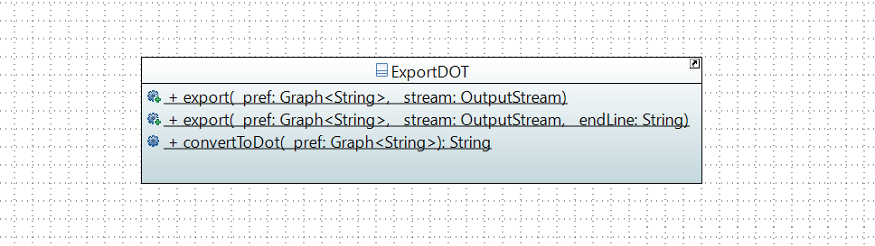

= Import/Export methods

== Export Preference in DOT Format

=== What does this class do ? +

The main goal of the ExportDOT class is to export all link:https://guava.dev/releases/23.0/api/docs/com/google/common/graph/Graph.html[Graph] in link:./GUIInputFiles.adoc[DOT format]. 

A preference can be represented by a *directed* graph. The preference interface has a method link:./preferenceInterfaces.adoc[asGraph()] which returns a preference as a Graph. So all preferences can be converted into a graph and given to the export() method of the ExportDOT class.

The export() method of the ExportDOT class verify that the provided graph is a directed graph or not and then converts it to DOT format. Finally, the link:https://docs.oracle.com/javase/7/docs/api/java/io/OutputStream.html[OutputStream] given as argument provides an output stream to a file. We can write on this stream with the OutputStream's write() method. 

=== Export Preference in DOT format +

This class allows you to export a preference in DOT format using a conversion and export method.

== Import Profile

=== Import Profile from several data formats by ReadProfile

The ReadProfile class allows to create and display link:./profileInterfaces.adoc[Profiles] from different ressources (InputStream, link:https://docs.oracle.com/javase/7/docs/api/java/net/URL.html[URL], or link:https://www.ibm.com/docs/en/z-open-unit-test/2.0.x?topic=SSZHNR_2.0.0/org.eclipse.platform.doc.isv/reference/api/org/eclipse/swt/widgets/Table.html[Table]).
To do this, it uses the ProfileBuilder and StrictProfileBuilder classes. +

image:../assets/readprofile_diag_class.PNG[Import profile - Class Diagram]

*NB :* Currently, the ReadProfile class still uses the old Preference implementation (OldLinearPreferenceImpl) of the project.
It should be changed to a LinearPreference. +

[cols="1,1,2", options="header"] 
|===
|Method name
|Contract
|Relevance

|createProfileFromStream(InputStream in)
|The input stream provides voting informations and it returns a link:./profileInterfaces.adoc[ProfileI] by using the buildProfile method.
|Ok

|createProfileFromColumnsTable(Table table)
|The Table contains Voters in columns: each rows contains an alternative in preference order for a Voter, and the Voter is identified by the column index (like link:./GUIInputFiles.adoc[VotersToRankings format] without the first row and column that lists the alternatives and identifies the Voters). Finally, the method returns a ProfileI providing by the ProfileBuilder class.
|Ok

|createProfileFromRowsTable(Table table)
|The Table contains Voters in rows: each columns contains an alternative in preference order for a Voter, and the Voter is identified by the row index (link:./GUIInputFiles.adoc[more information]). Finally, the method returns a ProfileI providing by the ProfileBuilder class.
|It looks like there's something wrong with the "if" in the second "for" loop. !altText.equals("") instead of altText.equals("")?

|createProfileFromURL(URL url)
|A link:https://docs.oracle.com/javaee/7/api/javax/ws/rs/client/Client.html[Client] is created, it permit to build a new web resource target by giving URL at his target() method. The link:https://docs.oracle.com/javaee/7/api/javax/ws/rs/client/WebTarget.html[WebTarget] obtained build and invoke the get request in a single step (by using request().get()) to the URL. +
Finally the given link:https://docs.oracle.com/javaee/7/api/javax/ws/rs/core/Response.html[Response] is casted to ImputStream, and the InputStream is given to the createProfileFromStream() method which provide a ProfileI.
|Ok

|displayProfileFromstream(InputStream in)
|This method print the input file by a link:http://www.slf4j.org/apidocs/org/slf4j/Logger.html[Logger].
|Ok

|getAlternatives(List<String> ListofStrings)
|This method takes as argument a list of strings that represent alternatives. It returns an OldLinearPreferenceImpl. 
|Ok

|getStatsVoters(String s)
|This method takes a string which contains voters statistics (number,sum of count, number of unique alternatives). The string is converted in list of integer, and it is returned.
|Ok

|getPreferences(OldLinearPreferenceImpl alternative, String s)
|The string represents alternatives separates by a comma, this alternatives are added to the OldLinearPreferenceImpl given as argument.
|Ok

|createStrictPreferenceFrom(String stringPreference)
|A string with "Alternative1,Alternative2,Alternative3..." format is given as an argument to the method and it returns a Preference (OldLinearPreferenceImpl).
|Ok

|buildProfile(List<String> file, OldLinearPreferenceImpl listAlternative, int nbVoters)
|The List of strings which represents the number of votes for each preference, the OldLinearPreferenceImpl, and the number of Voters, are returned as ProfileI by using the StrictProfileBuilder class. 
|Ok

|===

=== Read Profile from ODS files

ODS files are worksheet files that are used in OpenOffice, for example. 
link:./GUIInputFiles.adoc[Here] we have defined several data formats for ODS files: RanksFormat, VotersToRanking, and CountOfRanking.
The ReadODS class allows to read and describe profiles from these data formats, and create Set of link:./preferenceInterfaces.adoc[ImmutableCompletePreference].  

image:../assets/readods_diag_class.PNG[Read a profile with readODS - Class Diagram]

[cols="1,2", options="header"] 
|===
|Method name
|Contract

|checkFormatandPrint(InputStream in)
|The data format of the input stream is checked (RanksFormat or VotersToRanking or CountOfRanking). It returns a string with voting information by using the most suitable printFormat method (see next methods descriptions).

|printFormatCountOfRanking(Table table)
|This is a string static method which takes an ods table containing voting information in CountOfRanking format in argument. And it returns a string with voting information. It is used to describe the information contained.

|printFormatRanksFormat(Table table)
|This is a string static method which takes an ods table containing voting information in RanksFormat format in argument. And it returns a string with voting information. It is used to describe the information contained.

|printFormatVotersToRanking(Table table)
|This is a string static method which takes an ods table containing voting information in VotersToRanking format in argument. And it returns a string with voting information. It is used to describe the information contained.

|getAlternatives(Table table)
|This is a static method which takes an ods table containing voting information in argument and returns an list of Alternatives.

|getnbToVoters(Table table)
|This is a static method which takes an ods table containing voting information in argument and returns the number (integer) of voters.

|checkFormatandReturnCompletePreference(InputStream in)
|This method uses the following two methods (completeFormatRanksFormat() and completeFormatVotersToRankings()) after checking the input format of the ImputStream (RanksFormat or VotersToRanking). And finally, it returns an ImmutableSet of ImmutableCompletePreference. 

|completeFormatRanksFormat(Table table)
|This is a static method which takes an ods table containing voting information in argument (in RanksFormat format) and returns an ImmutableSet of ImmutableCompletePreference.

|completeFormatVotersToRankings(Table table)
|This is a static method which takes an ods table containing voting information in argument (in VotersToRanking format) and returns an ImmutableSet of ImmutableCompletePreference.

|===
