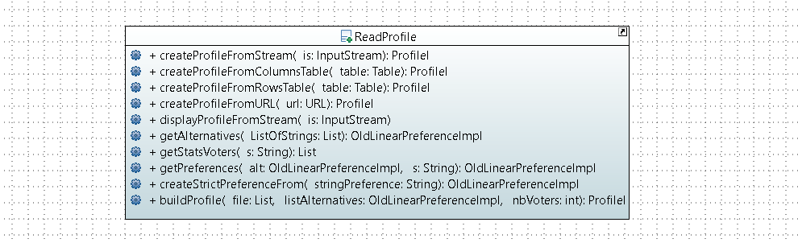
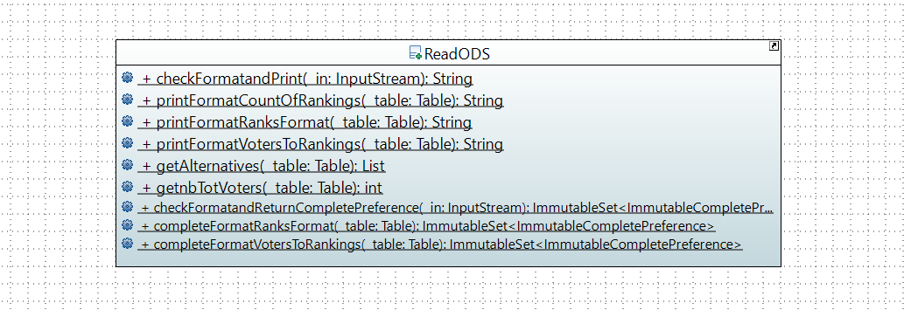

= Export a preference in DOT format

====== link:../README.adoc[Summary]

=== Export Preference in DOT Format

image:../assets/export_in_dotformat_diag_class.PNG[Export in DOT format - Class Diagram]

=== What will do this class +

The goal of the ExportDOT class is to export a preference in link:./GUIInputFiles.adoc[DOT format]. 

A preference can be represented by a *directed* graph. The preference interface has a method link:./preferenceInterfaces.adoc[asGraph()] which returns a preference as a link:https://jgrapht.org/javadoc/org.jgrapht.core/org/jgrapht/Graph.html[Graph] _(*)_. So all preferences can be converted into a graph and given to the export() method of the ExportDOT class.

The export() method of the ExportDOT class verify that the provided graph is a directed graph or not and then converts it to DOT format. Finally, the link:https://docs.oracle.com/javase/7/docs/api/java/io/OutputStream.html[OutputStream] given as argument provides an output stream to a file. We can create a link:https://docs.oracle.com/javase/7/docs/api/java/io/PrintWriter.html[Writer] on this stream and write in the file (see the next example for more informations about write stream). 

----
//Create a string by using StringBuilder by preference
StringBuilder dot = new StringBuilder();
dot.append("inputString-DOTformat");

//Create a Writer from the OutputStream - the output is the destination
Writer writer =new BufferedWritter(new OutputStream(output));

//Give the String to the Writer
writer.write(dot)
//You can also use the append() method of the Writer
writer.append(dot)
----

== Export Preference in DOT format methods analysis +

[cols="1,1,2", options="header"] 
|===
|Method name
|Contract
|Relevance

|export(Graph pref, OutputStream stream)
|This is a static void method which takes two argument : a graph that represents a preference and a OutputStream (provides an output stream to a file) which export it in DOT format. It would be useful to verify that the export method receives a directed graph or not by using the isDirectedGraph() method. Then convertToDot() converts the graph and sends the string to the Writer given by the OutputStream to write in the output file. 
|To do

|isDirectedGraph(Graph g)
|This is a static method which returns true when the argument is a directed graph.  
|To do

|convertToDoT(DirectedGraph g)
|This is a static method which returns the directed graph in DOT Format as String.
|To do

|===

_(*) Be carefull, currently the asGraph() method of the Preference interface returns a Graph. We can't be sure that the returned Graph is a directed graph. This can be a problem because usually a connection between two vertices of a graph is represented by "--" and by "->" for a directed graph in DOT format. Thus the conversion might not be good._

= Import Profile

=== Import Profile from several data formats by ReadProfile

The ReadProfile class allows to create and display Profiles from different ressources (InputStream, link:https://docs.oracle.com/javase/7/docs/api/java/net/URL.html[URL], or link:https://www.ibm.com/docs/en/z-open-unit-test/2.0.x?topic=SSZHNR_2.0.0/org.eclipse.platform.doc.isv/reference/api/org/eclipse/swt/widgets/Table.html[Table]).
To do this, it uses the ProfileBuilder and StrictProfileBuilder classes.

[cols="1,1,2", options="header"] 
|===
|Method name
|Contract
|Relevance

|createProfileFromStream(InputStream in)
|This method takes an input stream in argument which provides voting informations and it returns a link:./profileInterfaces.doc[IProfile] by using the buildProfile method.
|Ok

|createProfileFromColumnsTable(Table table)
|This method takes a Table (a kind of spreadsheet) with Voters in columns and returns a ProfileI providing by the ProfileBuilder class.
|Ok

|createProfileFromRowsTable(Table table)
|This method takes a Table with Voters in rows and returns a ProfileI providing by the ProfileBuilder class.
|Ok

|createProfileFromURL(URL url)
|This method takes an URL in argument and returns a ProfileI providing by the createProfileFromStream() method of this class.
|Ok

|displayProfileFromstream(InputStream in)
|This method takes an input stream in argument and print the input file by a link:http://www.slf4j.org/apidocs/org/slf4j/Logger.html[Logger]
|Ok

|getAlternatives(List ListofStrings)
|
|Ok

|getStatsVoters(String s)
|This method takes a string which contains voters statistics (number,sum of count, number of unique alternatives). The string is converted in list of integer, and it is returned.
|Ok

|getPreferences(OldLinearPreferenceImpl alternative, String s)
|
|Ok

|createStrictPreferenceFrom(String stringPreference)
|
|Ok

|buildProfile(List<String> file, OldLinearPreferenceImpl listAlternative, int nbVoters)
|This method takes a List which represents the number of votes for each preference, an OldLinearPreferenceImpl which represents a list of alternatives, and the number of Voters. By using the StrictProfileBuilder class, this method return a ProfileI. 
|Ok

|===

=== Read Profile from ODS files

ODS files are worksheet files that are used in OpenOffice, for example. 
link:./GUIInputFiles.adoc[Here] we have defined several data formats for ODS files: RanksFormat, VotersToRanking, and CountOfRanking.
The ReadODS class allows to read and describe profiles from these data formats, and create Set of link:./preferenceInterfaces.adoc[ImmutableCompletePreference].  

[cols="1,1,2", options="header"] 
|===
|Method name
|Contract
|Relevance

|checkFormatandPrint(InputStream in)
|This is a static method wich check the data format of the input stream (RanksFormat or VotersToRanking or CountOfRanking). It returns a string with voting information by using the most suitable printFormat method (see next methods descriptions).
|Ok 

|printFormatCountOfRanking(Table table)
|This is a string static method which takes an ods table containing voting information in CountOfRanking format in argument. And it returns a string with voting information. It is used to describe the information contained.
|Ok

|printFormatRanksFormat(Table table)
|This is a string static method which takes an ods table containing voting information in RanksFormat format in argument. And it returns a string with voting information. It is used to describe the information contained.
|Ok

|printFormatVotersToRanking(Table table)
|This is a string static method which takes an ods table containing voting information in VotersToRanking format in argument. And it returns a string with voting information. It is used to describe the information contained.
|Ok

|getAlternatives(Table table)
|This is a static method which takes an ods table containing voting information in argument and returns an list of Alternatives.
|Ok

|getnbToVoters(Table table)
|This is a static method which takes an ods table containing voting information in argument and returns the number (integer) of voters.
|Ok

|checkFormatandReturnCompletePreference(InputStream in)
|This is a static method which takes an input stream in argument. This method uses the following two methods (completeFormatRanksFormat() and completeFormatVotersToRankings()) after checking the input format (RanksFormat or VotersToRanking). And finally, it returns an ImmutableSet of ImmutableCompletePreference. 
|Ok

|completeFormatRanksFormat(Table table)
|This is a static method which takes an ods table containing voting information in argument (in RanksFormat format) and returns an ImmutableSet of ImmutableCompletePreference.
|Ok

|completeFormatVotersToRankings(Table table)
|This is a static method which takes an ods table containing voting information in argument (in VotersToRanking format) and returns an ImmutableSet of ImmutableCompletePreference.
|Ok

|===
