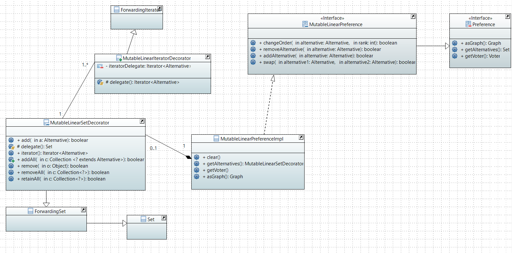
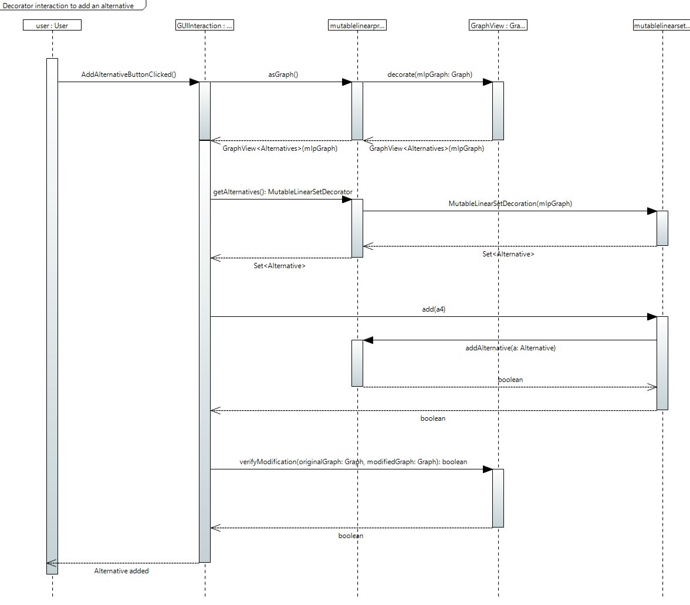

= Decorator documentation

====== link:../README.adoc[Summary]

=== What is a decorator and how is it useful ?

The link:https://en.wikipedia.org/wiki/Decorator_pattern[decorator pattern] is a design pattern that allows behavior to be added to an individual object, dynamically, without affecting the behavior of other objects from the same class. In other words, if your object structure can be broken by modifying one of its attributes (ex : set.add(_something_)), it is absolutely necessary to encapsulate the attribute(s) with a decorator to override the dangerous methods (ex : add).

Therefore, when the user will attempt to use one of the risky methods on an attribute, he will actually call the overrided one (decoratorSet.add()) instead of the one he thinks (set.add()) without knowing it.

The decorator has only one attribute called delegate that represents the decorated object. It extends a specific interface. For instance, if the threatened attribute is a set, it will extend ForwardingSet (containing all the Set methods). That is why the decorator has a delegate() method in addition of all the basic methods coming from the interface.

=== Decorators in J-voting

In our project, linearity issues forced us to resort to use decorators. Indeed, we manipulate mutable preferences. In MutableLinearPreferenceImpl, there are 4 attributes that can be modified : 

* a list

* a set 

* a graph

* a voter

This class contains getter methods (for the set and the graph) which is problematic because the user could reach and modify one of these two attributes. Yet, the four attributes always have to be in accordance with each other. Thus, if the set or the graph is modified, so must the other attributes.
Thus, we implemented a decorator for the set extending  link:https://guava.dev/releases/19.0/api/docs/com/google/common/collect/ForwardingSet.html[ForwardingSet] and one for the graph extending link:https://github.com/google/guava/blob/master/guava/src/com/google/common/graph/ForwardingGraph.java[ForwardingGraph] of Guava. The purpose of MutableLinearPreferenceDecorator is the same. We use it as a "protector" for MutableLinearPreferenceImpl. It is important to know that ForwardingGraph is not ready to be used for general purposes so we created our own ForwardingGraph copying it. 

=== Decorator Class Diagram

This class diagram represents the relationships between the MutableLinearSetDecorator and MutableLinearIteratorDecorator classes with the MutableLinearPreferenceImpl class through the MutableLinearPreference interface.
You can have an overview of the preferences documentation link:./preferenceInterfaces.adoc[here].

=== Decorator Sequence Diagram

Let's illustrate what happens when the user gets the graph of a MutableLinearPreferenceImpl, then modifies the preference through an other method and gets the graph again. The graph will change in accordance with the MutableLinearPreferenceImpl modification.

* 1. The user will click on the button to add an alternative.

* 2. It will calls asGraph() in MutableLinearPreferenceDecorator. This call results in creating a GraphView graphView, which is returned to the interaction class. For instance : [1→1; 1→2; 1→3; 2→2; 2→3; 3→3].

* 3. The interaction class will then calls getAlternatives() on mlp to access its set. This call creates a MutableLinearSetDecorator mlsd, which is returned to the interaction class and would be like {1,2,3}.

* 4. Then, it will call add(a4) on mlsd to modify the preference. Yet, this add method is not the Java method but the one we override in the mlsd. We wrote it in such a way that it calls the addAlternative(a4) method on mlp to add the alternative to the whole preference and not just the set.

* 5. Finally, it will call the verifyModification method which will return a boolean to see if the graph has changed. The method verifyModification is not implemented yet in the GraphView class.

