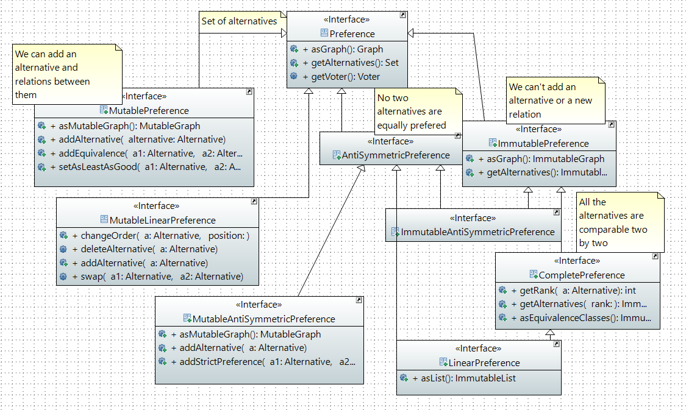

= 1.1 Preferences Interfaces Documentation

=== Preferences Interfaces Diagram

=== Preference definition +
A Preference is the ranking between Alternatives and it can be represented by a *directed* graph.

A graph can be used to represent a classification between elements (link:https://hal.archives-ouvertes.fr/hal-01526540/document[here] for more informations : _Philippe Vincke, La modélisation des préférences, Institut de mathématiques économiques 1985, 24 p., figures, bibliographie. ffhal-01526540_).
In the case of a preference, the graph will be necessarily directed, because a Preference is a ranking of Alternatives. Each vertex represents an alternative, and the direction of the edge indicates the direction of preference.

*Example of element ranking with graph :*

image:../assets/exempleGraphPref.png[width=35%, align="center"]

=== MutablePreference +
A Preference where you can add Alternatives. +
You can also relate two alternatives in two ways : 

* The first one is "At least as good".
* The second one is "Equivalence".

=== AntiSymmetricPreference +
The only possible relation is "Greater than".

image:../assets/AntisymmetricPreferenceScheme.PNG[AntisymmetricPreferenceScheme]

=== ImmutablePreference +
An Immutable Preference is a preference that cannot be modified. We can't add Alternatives or any relations.

// === MutableAntiSymmetricPreference +
// AntiSymmetricPreference + MutablePreference

// === ImmutableAntySymmetricPreference +
// AntiSymmetricPreference + ImmutablePreference

=== CompletePreference +
An ImmutablePreference where all the Alternatives have a two-to-one relation for each couple. +
A CompletePreference represents a complete preorder, also called a weak order.
 
image:../assets/CompletePreferenceScheme.PNG[CompletePreferenceScheme]

=== LinearPreference +
A linear preference is an antisymmetric complete preference. A linear preference represents a linear order, or equivalently an antisymmetric complete order, or also equivalently, the reduction of a weak-order.

image:../assets/LinearPreferenceScheme.PNG[LinearPreferenceScheme]

== Preferences methods analysis +

=== *Preference*

[cols="1,1,2", options="header"] 
|===
|Method name
|Contract

|asGraph()
|In the graph : a relation from a to b means "a is at least as good as b". This graph can't be modified, but is not necessarily immutable.
Reflexive and transitive.
@return the Graph corresponding to the Preference

|asStrictGraph()
| This method is going to be implemented in the Java iteration, and so its contract.

|===

=== *MutablePreference*

[cols="1,1,2", options="header"] 
|===
|Method name
|Contract
|Relevance

|asMutableGraph()
| Returns the Graph corresponding to the Preference. This graph is not necessarily transitive and not necessarily reflexive.
| Need to add a decorator (check the problem with AsGraph)

|addEquivalence(Alternative a1, Alternative a2)
| Adds an edge from an alternative a1 to an alternative a2 and from a2 to a1. a1 and a2 are ex-aequo.
| The method does not deal with the fact that when an alternative is not in the graph it must be added. 

|setAsLeastAsGood(Alternative a1, Alternative a2)
| Adds an edge from an alternative a1 to an alternative a2, so that a1 is asleast as good as a2 (a1 >= a2). 
| Similarly, the method does not deal with the fact that when an alternative is not in the graph it must be added. 

|===

=== *MutableAntiSymmetricPreference*

[cols="1,1,2", options="header"] 
|===
|Method name
|Contract
|Relevance

|asMutableGraph()
| This graph is not necessarily transitively closed and not necessarily reflexive. This method might refuse that an edge be added that would result in the transitive closure violating anti-symmetry, though it will not necessarily check.
| The exception is not raised. Need to add a decorator (check the problem with AsGraph)

|addStrictPreference(Alternative a1, Alternative a2)
| Adds an edge from a1 to a2, so that a1 is preferred to a2 (a1 > a2). If one of them is not in the graph, they are added.
Graph is rearranged : a transitive closure is applied to it
@param a1 preferred alternative to a2
@param a2 "lower" alternative
| Ok.

|===

=== *ImmutablePreference*

[cols="1,1,2", options="header"] 
|===
|Method name
|Contract
|Relevance

|asGraph()
| Returns the Graph corresponding to the Preference. This graph is immutable, reflexive and transitive.
| OK. However, the method doesn't check the transitivity and reflexivity.

|===

=== *CompletePreference*

[cols="1,1,2", options="header"] 
|===
|Method name
|Contract
|Relevance

|asEquivalenceClasses()
|Returns the same data but in an Immutable list object. A set of alternative is strictly prefered to next sets. All the alternatives in a set are considered ex-aequo.
| OK.

|===

=== *LinearPreference*

[cols="1,1,2", options="header"] 
|===
|Method name
|Contract
|Relevance

|asList()
|Returns a sorted list of alternatives corresponding to the preference.
| OK.				                                                     

|===
//
//=== *MutableinearPreference*
//
//This class allows you to change the order of the alternatives in a class. It also allows you to add or remove alternatives.

